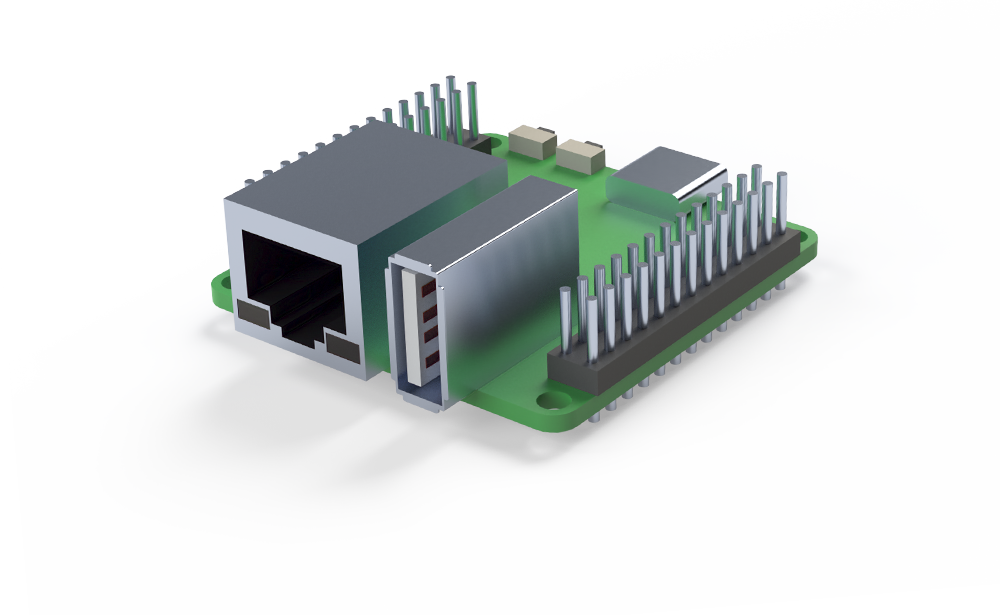

# [Rock Pi S PCA](https://wiki.radxa.com/RockpiS)

[Rock-Pi-S-V13.STEP](Rock-Pi-S-V13.STEP) is a rough model of the Rock Pi S V13 PCA. 
It can be used to provide rough connector clearance checks on client projects.
