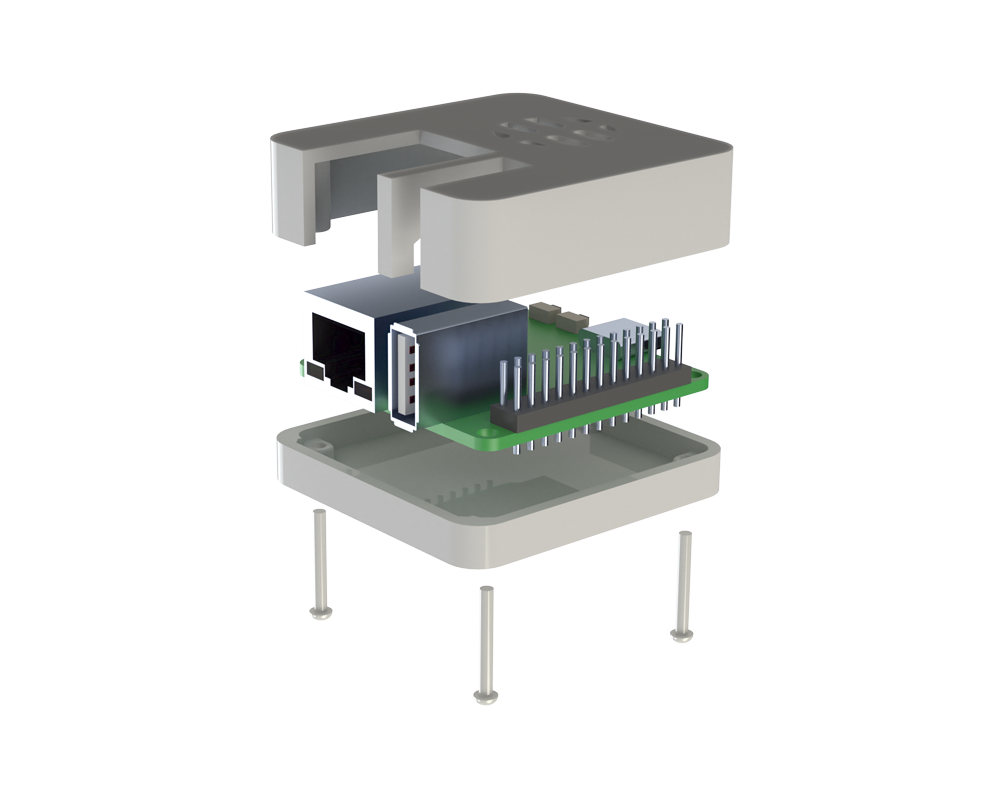

# Rock Pi S V13 Simple Enclosure

This is a very simple 3D printable enclosure for the Rock Pi S V13. 
It was designed to be extremely simple such that it can be easily printed on a low-spec printer (Up! Mini 1).

The enclosure comprises the lid and base components:

* [Rock-Pi-S-Lid-V13.STEP](Rock-Pi-S-Lid-V13.STEP)
* [Rock-Pi-S-Base-V13.STEP](Rock-Pi-S-Base-V13.STEP)

## Features

* Exposes RJ45 connector.
* Exposes USB 2.0 connector. 
* Exposes USB C connector.
* Exposes maskrom and reset switches.
* Exposes micro-SD slot. 
* Vented to improve SOC performance.

## Assembly

It is suggested the lid and base are both printed with the external sides down.
Although this tends to reduce the visual quality of the case, it improves the accuracy of the internal cutouts to ensure best fit of the PCA. 

The board should first be aligned with the lid component, this can be done by angling the USB / RJ45 connectors into the cutouts. 

The base will then snap onto the bottom side of the PCA and can be secured to the lid using 4x m.2 12mm screws. 
These should simply self tap and sufficiently secure the enclosure, although you may prefer to enlarge the lid holes and use heat-set inserts.
